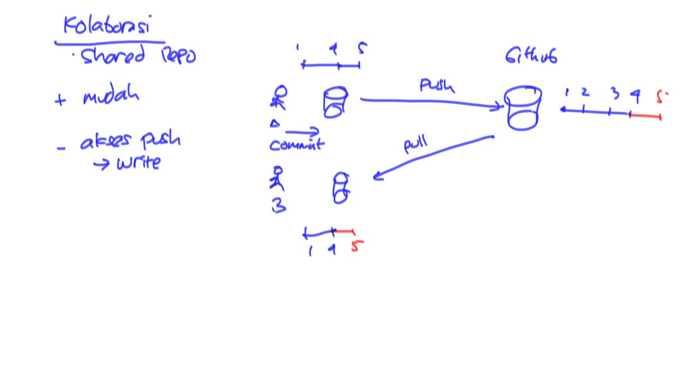
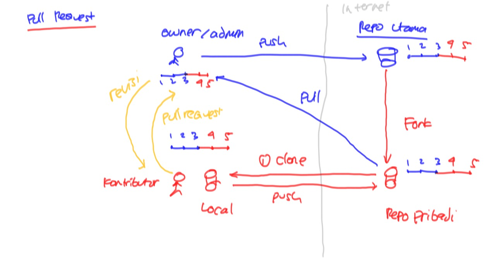

# Training Git #

Materi:

* Instalasi Git
* Membuat Repository di Local
* Menambah File
* Menyimpan Perubahan di Local

* Membuat Repository di Remote
* Mengupload Perubahan ke Remote

* Workflow Kolaborasi

    * Shared Repository

	* Pull Request

